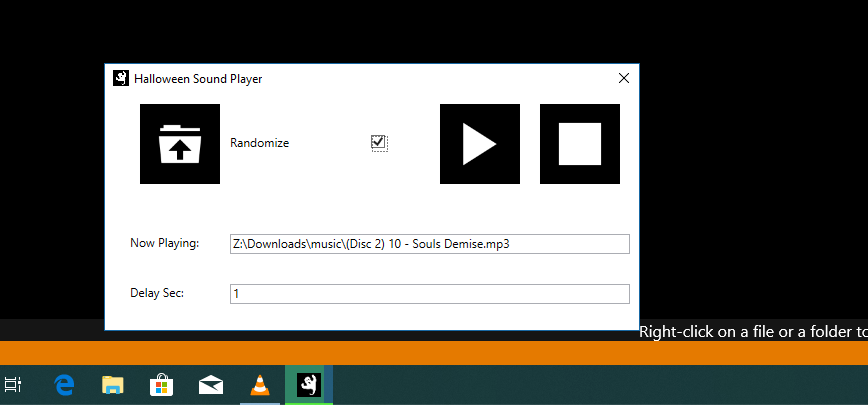

# Halloween Sound Player

This is an incredibly simple WPF app that asks for a directory and gives you the option to play sounds in alaphabetical order or randomized with a certain delay between tracks. 

If you set the delay to 1, it is good as a super simple media player. If you set it to a higher value, its good to play scary sound effects at intervals.

